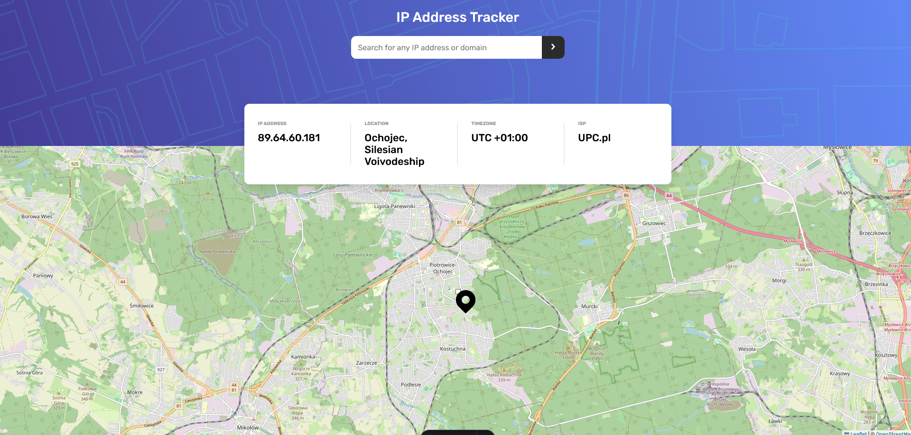

# IP address

IP address tracker inspired by challenge from [IP address tracker challenge on Frontend Mentor](https://www.frontendmentor.io/challenges/ip-address-tracker-I8-0yYAH0)

## Table of contents

- [Overview](#overview)
  - [The challenge](#the-challenge)
  - [Screenshot](#screenshot)
  - [Links](#links)
- [My process](#my-process)
  - [Built with](#built-with)
  - [What I learned](#what-i-learned)
  - [Continued development](#continued-development)
  - [Useful resources](#useful-resources)
- [Author](#author)
- [Acknowledgments](#acknowledgments)

## Overview

### The challenge

Users should be able to:

- View the optimal layout for each page depending on their device's screen size
- See hover states for all interactive elements on the page
- See their own IP address on the map on the initial page load
- Search for any IP addresses or domains and see the key information and location

### Screenshot

### Links

- Solution URL: [Github](https://github.com/Kuba-Bujanowicz/frontend-mentor/tree/main/ip-tracker)
- Live Site URL: [IP Tracker](https://lovely-rugelach-986d00.netlify.app/)

## My process

### Built with

- HTML5
- Sass
- Ipify
- Leaflet
- Astro
- Qwik

## Author

- Github - [Kuba Bujanowicz](https://github.com/Kuba-Bujanowicz)
- LinkedIn - [Kuba Bujanowicz](https://www.linkedin.com/in/kuba-bujanowicz-2ba715253/)
- Frontend Mentor - [Frontend Mentor](https://www.frontendmentor.io)
